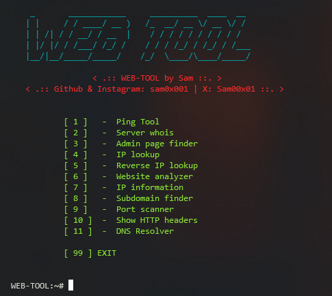

# WEB-TOOL
A simple python tool for scanning web applications.

## Installation & Usage
### `python3` is required to run this tool
1- Installtion:
```
pip3 install -r requirements.txt
```
2- Run:
```
python3 web-tool.py
```
Enjoy using it :)

## Options
- Ping Tool
- Server Whois
- Admin page finder
- IP Lookup
- Reverse IP Lookup
- Website analyzer
- IP Information
- Subdomain finder
- Port scanner
- Show HTTP headers
- DNS Resolver

## Screenshot


## Social
You can follow me on:
- <a href="https://instagram.com/sam0x001" target="_blank"> Instagram </a>
- <a href="https://x.com/sam00x01" target="_blank"> X (Twitter) </a>
- <a href="mailto:saminium@duck.com" target="_blank"> Send me an Email </a>
